# Cluedo

<!-- Scrrenshot of finished project -->

## Live site
[PyClue on Heroku](https://pyclue.herokuapp.com/)

## Repository

[Cluedo GitHub Repo](https://github.com/dragon-fire-fly/cluedo)

## Objective
"PyClue" is a one player Python terminal game based upon the classic detective game Cluedo. More information about the history and gameplay of Cluedo can be found on the [Cluedo wikidpedia page](https://en.wikipedia.org/wiki/Cluedo).

## Story
You were invited to a dinner party at the esteemed Dr Black's country Mansion for an evening of dinner, drinks, dancing and debauchery. 

Unfortunately, as the clock struck midnight, a piercing scream reverberated throughout the Manor, caused by the discovery of Dr Black's body. He has been murdered in cold blood.

You and the other five guests have gathered around Dr Black's body in the hallway, but something seems strange. This is clearly not the scene of the crime.

In addition, a series of objects found around the Manor have been collected as potential murder weapons and lie strewn around the body.

Your role now is to figure out WHO committed the crime, WHICH item was used and WHERE the murder took place.... and hopefully prove your innocence!

Roll the die to move around the Mansion and perform investigations to eliminate suspects, items and locations in order to figure out the details of this murder most foul.

Once you think you know WHO, WHAT and WHERE, you may make an accusation. Be careful though, if you guess incorrectly, perhaps suspicion will fall on YOU. 

Now what are you waiting for? There's no time to lose!

## Brief

## User Experience

### Wireframes?

### Colour scheme?

## Logic
### Flow diagram
A basic flow diagram of the game mechanics is shown below.  
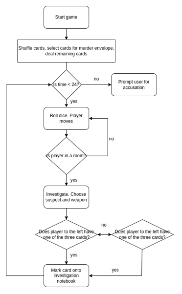

### Gameboard layout
The layout of rooms in the mansion in the original cluedo game are as follows:  
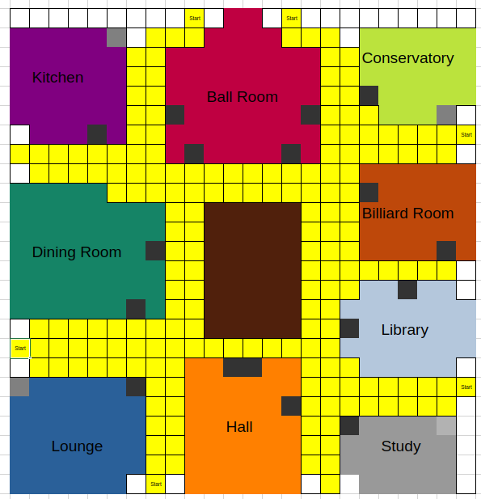

A simplified gameboard to be used in the PyClue game was designed on a grid system as follows:  
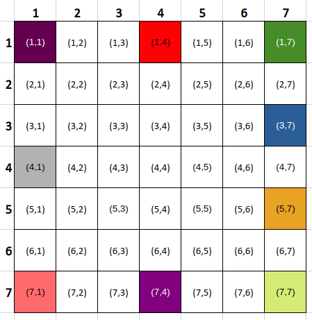

## Features

### Game Features
#### Main Menu
#### New game (with and without story)
#### View Rules

### Playing the game
#### Choose Character
<!-- Different character = diff starting location? -->
#### View Scorecard

#### Update Scorecard

#### Choose a room (inc. Secret Passageway)
- room distances are calculated and displayed (inc. secret passageway rooms)
- Player prompted for choice
- Player moved to or towards (depending on if enough moves available) chosen room or stays in current room if preferred

#### Investigation phase
- Choose a suspect
- Choose a weapon
- Input validation
- AI player shows card
- Scorecard updated

#### The Accusation
- Choose a suspect
- Choose a weapon
- Choose a room
- Input validation
- Check if player definitely wants to submit

#### Favicon
A magnifying glass icon was chosen as the favicon for the Heroku terminal program

### Python Coding Features
#### Game constants

 Click to expand and view the constants used for the game. These are lists, dictionaries and other iterables that are used by the game functions to set the initial (or in some cases updated) values for the game:

| .py file  | name  | img  |
|---|---|---|
| setup.py  | Room Locations  | 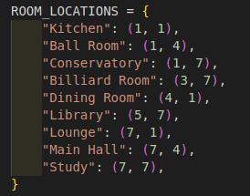  |
| setup.py  | Cards  | 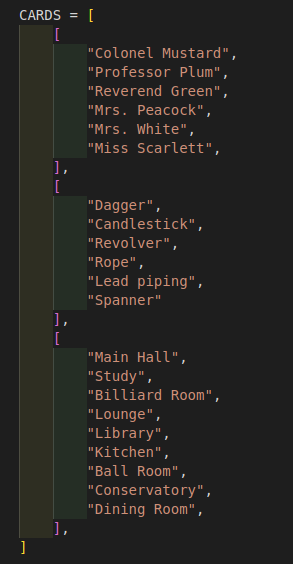  |
| setup.py  | Dealt cards (empty)  | 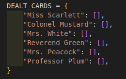   |
| setup.py  | Suspects  | 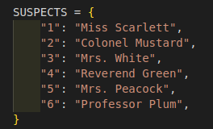   |
| setup.py  | Weapons  | 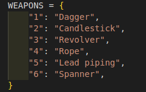   |
| setup.py  | Rooms  | 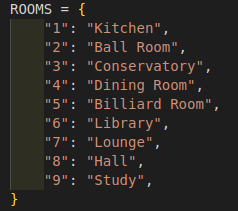   |
| setup.py  | Game Board  | 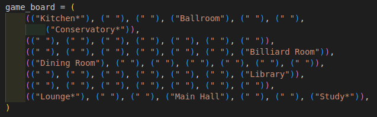   |
|  setup.py | Scorecard/investigation card  | 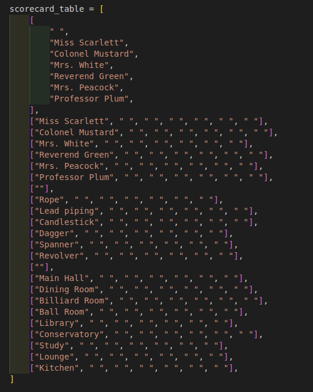   |

#### OOP
Classes were made for:
- Gameboard
- Player
- AI Players
- Card deck
- Scorecard

The code for each class is discussed below:

 Click to expand and view the Gameboard class code:

- **__ init __()**   
The Gameboard init method initializes the room dictionary (as room: (x, x))and the current player location (as a [x, x] list).  
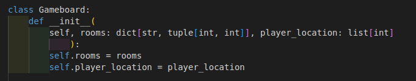  
- **update_player_location()**   
This method receives a new location (as [x, x] list) and updates the current location stored within the Gameboard class.  
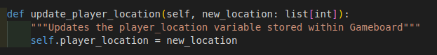  
- **current_player_location()**  
This method simply returns the current location stored within the Gameboard class.  
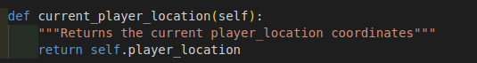  
- **calculate_distance()**  
This method takes the co-ordinates of two points (either as a [x, x] list or an (x, x) tuple) and calculates and returns the total distance between the two points as an int. The calculation adds all the spaces on the x and y axis as players are not allowed to move diagonally in Pyclue.   
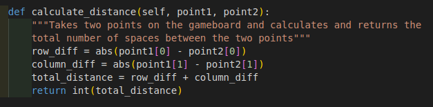  
- **room_distances()**   
This method starts with a dictionary of the rooms and a default value of 0 spaces for each room. The method then updates the distance (dictionary value)by calling the calculate_distance() method for each room in the dictionary and returns it.   
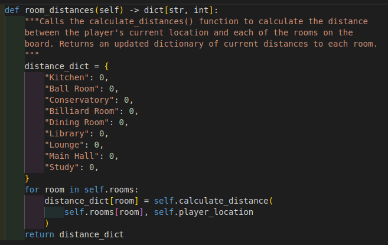  
- **which_room()**  
This method evaluates whether the co-ordinates of the player's current location matches the co-ordinates of any room in the room dictionary. If so,. it returns the name of the room. Otherwise, returns "hallway".    
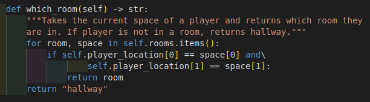  
- **choose_room()**  
This method calls the room_distances() method and the check_for_secret_passageways() method and displays the rooms with their corresponding distances to the user and prompts for a choice. The choice is validated with the number_input_validation() function and the desired room and updated room_distances library are returned.  
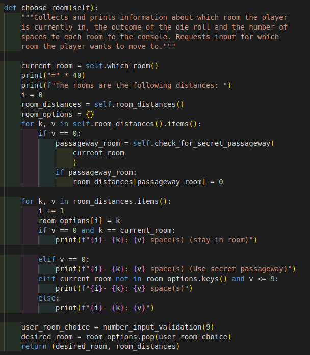  
- **check_for_secret_passageway()**  
This method checks whether the space the user is currently in is a room, and if so, checks whether that room has a secret passageway. The Kitchen and Study are linked with a passageway, as are the Lounge and the Conservatory. If a passageway is present, the name of the connected location is returned.
  

 Click to expand and view the Player class code:

- **__ init __()**  
The Player class init method initializes the suspect, weapon and room dictionaries as a number (str type e.g. "3") as the key and the name of the suspects, weapons or rooms as the values.  
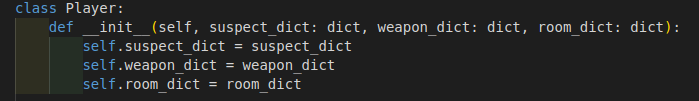  
- **choose_character()**  
Calls the number_dict_input_validation() method to prompt the user to choose a character. Returns the name of the character the user selected from the relevant value from the suspect dictionary.    
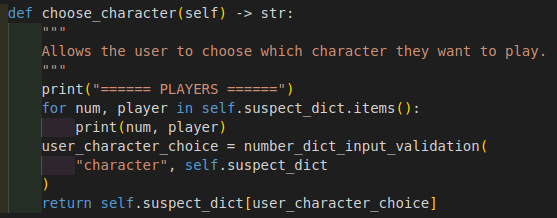  
- **set_starting_location()**  
Assigns the starting location for whichever player the user selected. Updates the gameboard object in the setup file with this location. Returns nothing.  
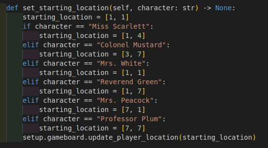  
- **roll_die()**  
Simply returns a random number between 1-6 using the randomint() method from the random class. 
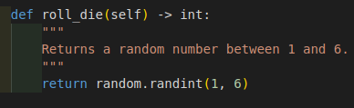  
- **move_player()**  
This method takes six arguments (current player location, desired room, current room, value of die roll, room distances dictionary and the room dictionary) in order to return the new player location after a player has chosen to move (or not to move!)  
  
    First, the method evaluates whether the user has rolled enough on the die to make it to the desired room from the current room. If so, the player location is updated to the desired room. If the desired room is different from the current room, it prints that the user is "walking" there. If the desired room is the same as the current room, it prints "you have chosen to remain in the <desired_room>".  
  
    If the user has not rolled enough to reach the desired room, they are given the option to move towards the desired room (by the number of spaces in the die roll), or to stay in the current room. If they choose to move towards the desired room, the player will be moved up/down by one space (depending on the direction of the desired room), then left/right by one space (depending on the direction of the desired room). Each time the player moves, one is subtracted from the die roll, until all the moves have been used up. The function then returns the co-ordinates of the new space.  

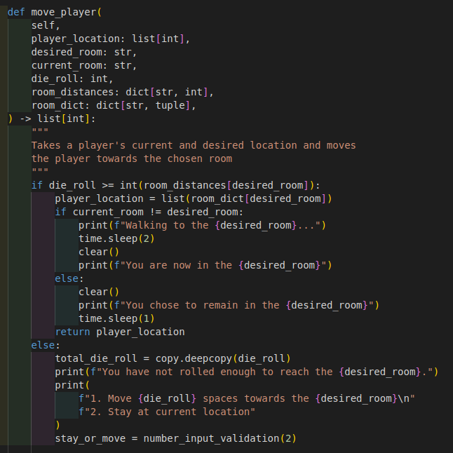 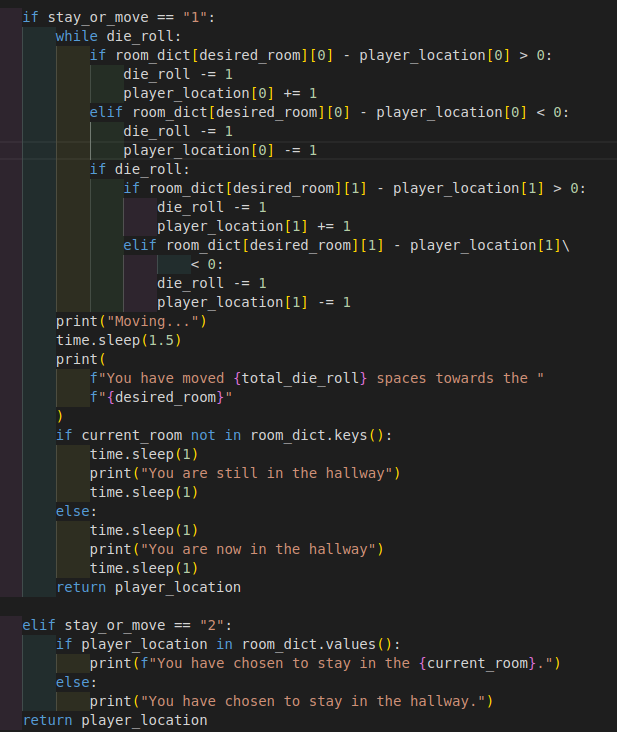  
- **choose_investigation_cards()**  
Uses suspect and weapon dictionaries to allow user to select a suspect and weapon for their investigation. The room for the investigation is determined by the current room, which is passed as an argument into this method. The method returns the suspect, weapon and current room as a list.   
  
- **make_accusation()**  
The make accusation method is similar to the choose investigation cards method detailed above, but allows the user to also choose any room. The accusation can be performed from anywhere, once the user reaches the end of their turn. The method uses the y/n input validation method, as well as the number dictionary input validation method to ensure that user input is valid. The method returns the names of the suspect, weapon and room as a list.  
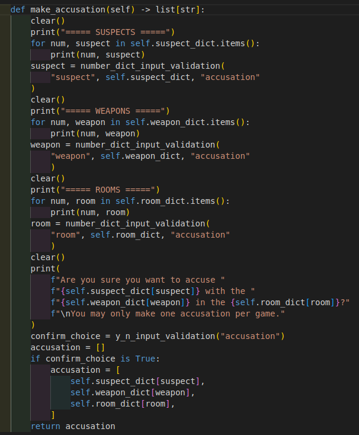  

 Click to expand and view the AI Player class code:

- __ init __()  
The AI player class only has an init method which initializes the name of the player and the list of three cards in their hand.  
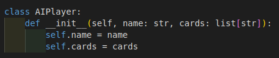  

 Click to expand and view the Cards class code:

- **__ init __()**  
The init method initializes the cards to be dealt, the dealt cards dictionary (which starts as an empty list for each character) and the murder envelope, which starts as a list of empty strings.  
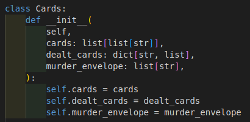  
- **shuffle_cards()**  
The shuffle cards method takes a list of strings and used the shuffle() method from the random module to shuffle the deck and return it.  
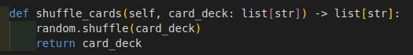  
- **deal_cards()**  
The deal cards method takes each of the sub lists from the cards list and calls the shuffle cards method. The method then pops the last card from each list to compile the murder envelope. The method then adds the remaining cards together into one deck and calls the shuffle_cards() method again. The shuffled cards are then assigned to each of the keys in the dealt_cards dictionary until all shuffled cards have been assigned.  
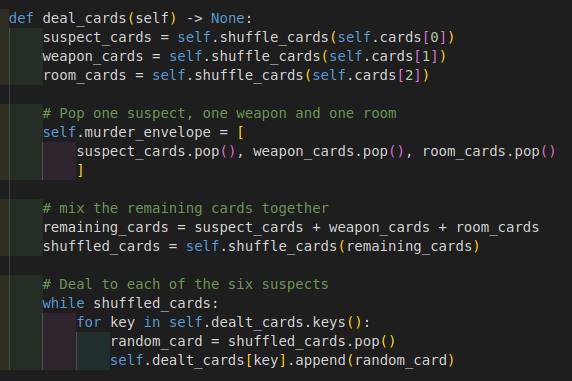  
- **check_murder_envelope()**  
This method takes the player's guess as a list of strings (suspect, weapon, room) and checks each card from the guess against each card in the murder envelope. If all three cards match (using the "and" logical operator in the conditional if statement), a win statement is printed and "win" is returned. Otherwise, the wrong guess and lose statement is printed and "lose" is returned.  
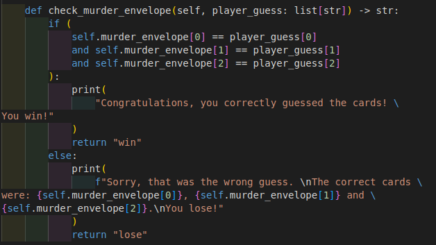  

 Click to expand and view the Scorecard class code:

- **__ init __()**  
The init method initializes the scorecard as a list of lists (where each list contains each row of data)  
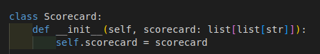  
- **show_scorecard()**  
The show scorecard method uses the imported tabulate module to display the list of lists as a table. The tabulate style chosen is "pretty". 
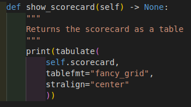  |
- **update_scorecard()**  
The update scorecard method takes as arguments the character who just showed a card and the card that they showed. The method then saves the index of the character from the first list, which acts as the column headings, as "char_num". The index of the list which contains the card is then saved as the "list_index" variable.
    These variables are combined to mark with an "x" the intersection between the character column and the card row by using `self.scorecard[list_index][char_num] = "x"`.  
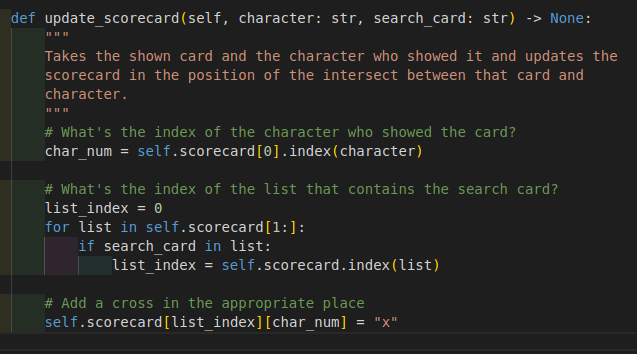  |

#### Custom Modules
The Classes were saved into seperate .py files which were then imported into setup.py to be instantiated as objects to be imported and used in the main run.py file.

 Click to expand and view the code for the setup.py functions:

- **main_menu()**  
The main menu consists of a while loop which uses the number_input_validation() method to request an input from the user to ascertain whether they want to start the game with or without the story or if they want to view the rules first.  
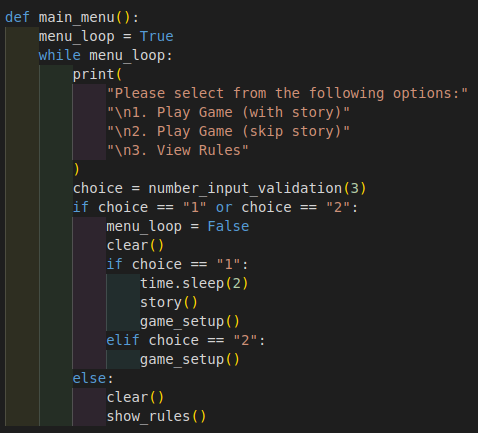  
- **show_rules()**  

  
- **game_setup()**  
The `game_setup()` function calls the `player.choose_character()` method to prompt the user to pick a character to play as. The starting location for that character is then assigned using the `player.set_starting_location(chosen_character)` method. The cards are then dealt with `cards.deal_cards()` and the user's hand is assigned with `user_hand = DEALT_CARDS.pop(chosen_character)` and these cards added to the investigation/scorecard with 
`for card in enumerate(user_hand):
        scorecard.update_scorecard(chosen_character, user_hand[card[0]])`.  
    The other 5 characters are generated by calling the `generate_ai_characters()` function (detailed below).  
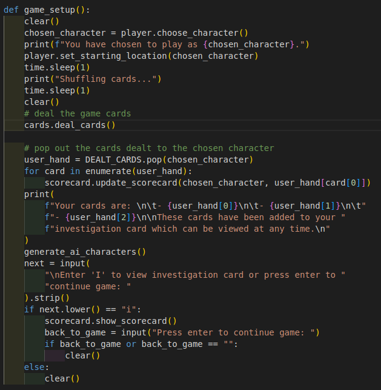  
- **generate_ai_characters()**  
The generate_ai_characters() function contains an if statement for each character to check whether the cards from the "DEALT_CARDS" list still exist in the dictionary. If so, an ai character is generated for that character and the cards in the DEALT_CARDS dictionary are assigned. If the `DEALT_CARDS.get(<character_name>)` returns false, this means that the cards have already been removed from the `DEALT_CARDS` list because it is the character the user chose to play as. In this case, the generation of ai character step is skipped (and because the `.get()` method is being used, no error is thrown).  
    The list of ai_character objects is returned from this function.
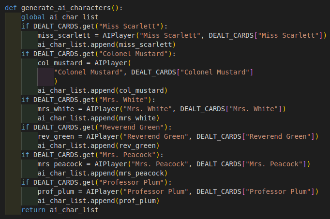  
- **story()**  
The story is broken into seven paragraphs to make it easier to read and a nicer user experience. Each part of the story is sequentially added to a "storyboard" which is printed (along with the logo) on each iteration of the printing loop. During each loop, the "new" part of the story is printed with a typewriter effect by using the sleep() method from the time module to pause for 0.025 seconds between each letter. The flush=True parameter is used to ensure that the print function prints each letter seperately, rather than printing all at once for efficiency, as is the default print behaviour.  
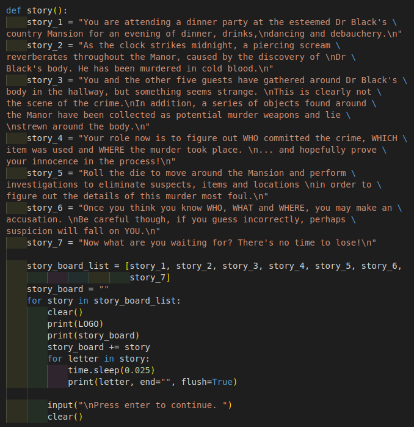  

 Click to expand and view the code for the run.py functions:

- main_game_loop()  
description 
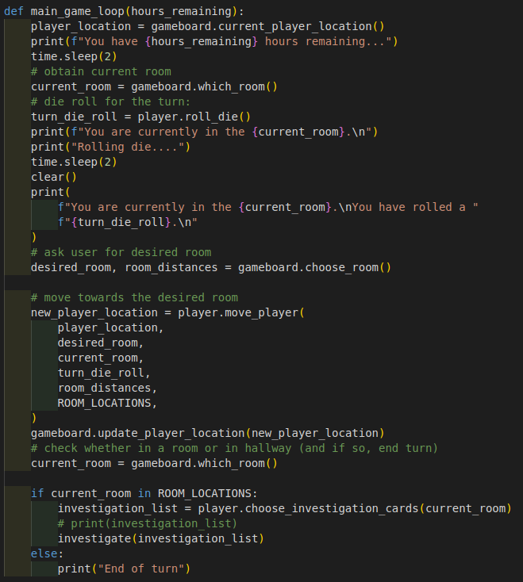  
- investigate()  
description     
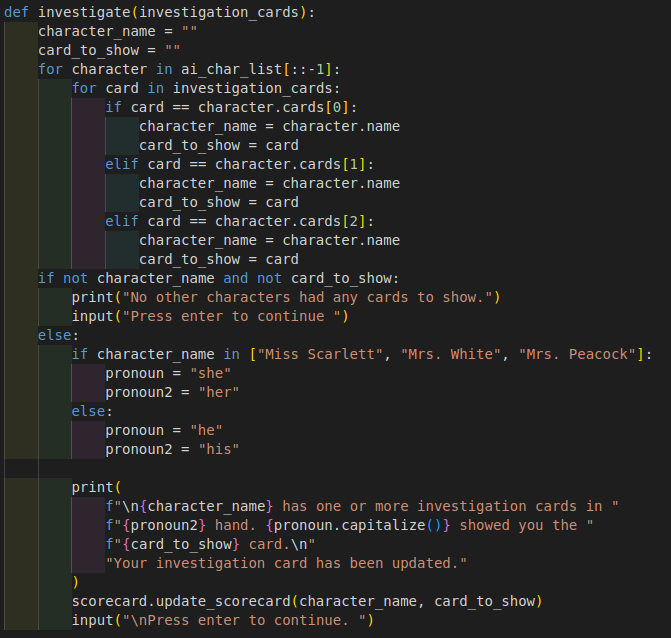  
- end_of_turn()   
description    
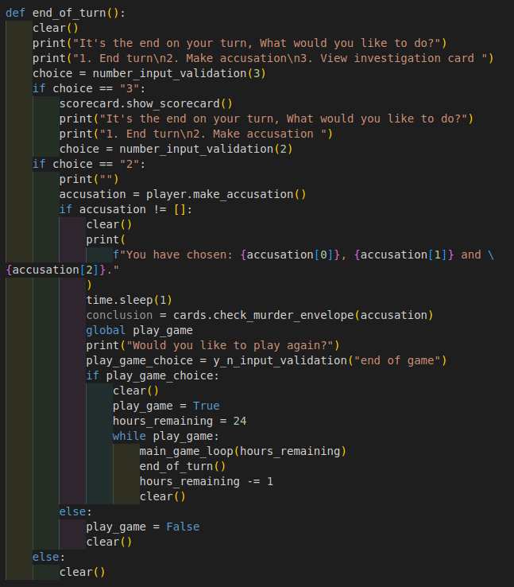  

 Click to expand and view the code for the validation.py functions:

- number_input_validation()  
Takes the number of options as an argument and prompts the user for a number between 1 and the number of options. If the user input is valid, the user choice (as a string) is returned. Otherwise, the user is informed that their answer was not valid and is prompted for a new input.  
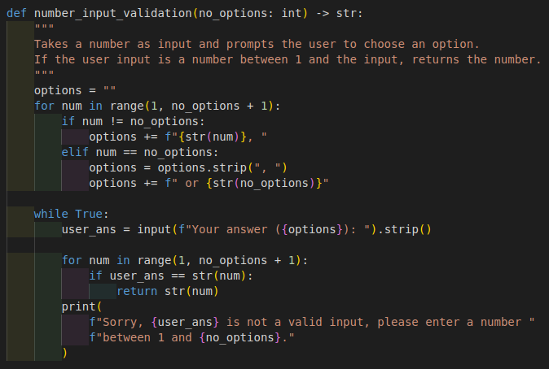  

- number_dict_input_validation()  
Accepts a string value ("character", "suspect", "weapon" or "room"), a relevant dictionary (suspect_dict, weapon_dict or room_dict) and optionally a phase ("investigation" or "accusation"). The user is prompted for an input relevant to the arguments passed. If the input is either a key or a value from the relevant dictionary, the key of the dictionary is returned. If the input is invalid, the user is informed and requeted for a new input.  
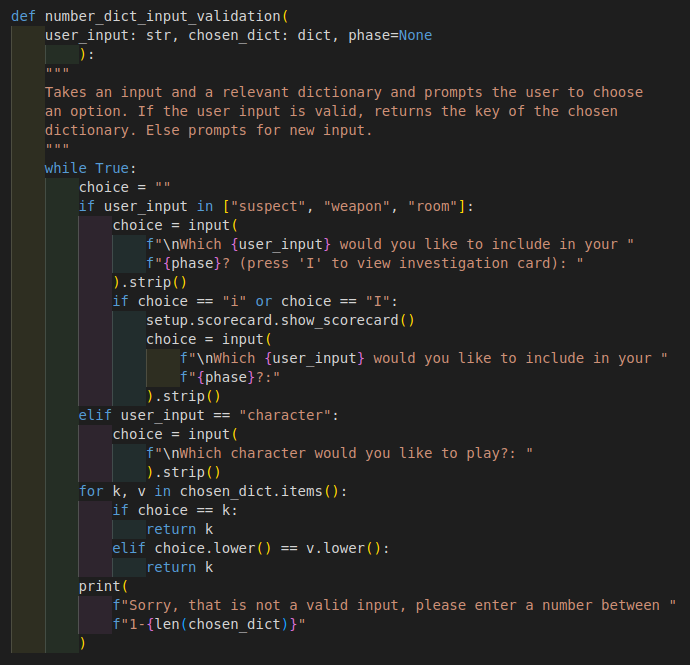  

- y_n_input_validation()  
This function prompts the user for a y/n answer (as a str type). The function asssesses whether the (lowercased) user input is in the list of "yes" words or "no" words. If the user input is in neither list, it informs the user that their answerwas not valid and requests a new answer. The function returns true or false, and if false, also prints an appropriate message.  
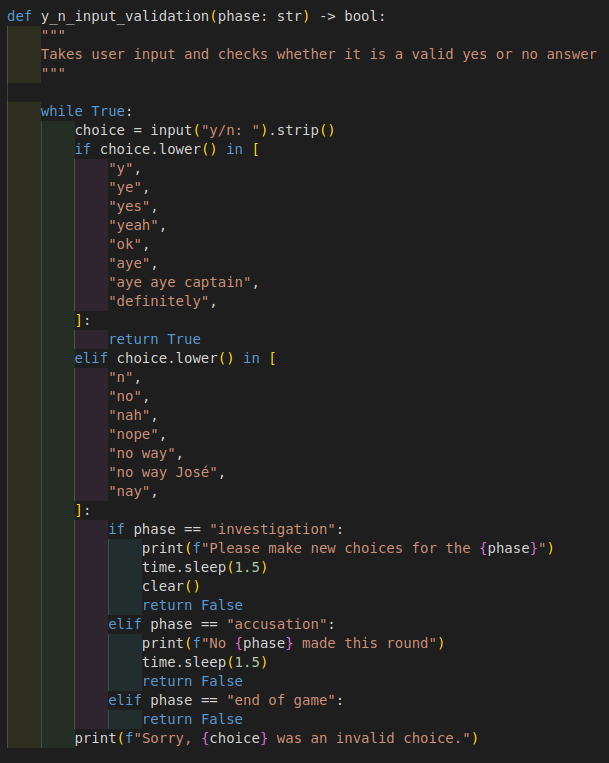  
- clear()  
Clear simply performs a terminal clearing function using the linux specific clearing method from the os module   
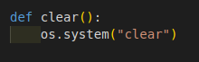

### Future Features
- save/load functionality
- difficulty setting
- multiplayer/ AI players playing

## Technologies Used
- [Python3](https://www.python.org/) as core programming language
- [Visual Studio Code](https://code.visualstudio.com/) - for offline code editing
- [Heroku](https://www.heroku.com) - for cloud hosting of the project
- [Draw.io](https://app.diagrams.net/) for creatinf flow diagram
- [Venv virtual environment](https://docs.python.org/3/library/venv.html) - for creating a virtual environment to work in
- Github

Python Modules used:
- random (randint - for generating random integers)
- time (sleep - for creating pauses between print statements)
- os (system("clear") - to clear the contents of the terminal)
- copy (deepcopy - for creating copies of variables)
- tabulate (tabulate - for creating tables)

## Testing
### Manual testing
### PEP-8 Compliance

## Bugs
### Resolved Bugs
### Outstanding Bugs

## Deployment
### Github
- Cloning

### Heroku

## Credits

logo:
http://patorjk.com/software/taag/#p=display&f=Bloody&t=PyClue%0A%0A%0A%0A

favicon:
https://game-icons.net/1x1/lorc/magnifying-glass.html#download
https://favicon.io/

## Rules:
1. The murderer, murder weapon and murder location have been placed inside the "murder envelope"
2. Roll the dice or use a secret passage each turn to move from room to room. You may move up, down or sideways, but not diagonally. 
3. On your turn, if you are in a room, you may question the other suspects about any suspect, any weapon and the location you are currently at. 
4. Starting with the player to your left, if that player has one of the three suggested cards, they must show you one. If they don't have any cards, they player to their left is questioned next, and so on.
5. Once you feel certain that you know the murderer, murder weapon and room, you may make an accusation. You may only make one accusation per game.

## Setup

setup.py contains all information pertinent to the setup of the game. This includes:

1. instatiating 
    - the gameboard class
    - the cards class
    - player class
    - AI player class
2. containing all lists and dictionaries for game setup

## General Gameplay
Each turn consists of the following 11 steps:
### Player turn:
1. minus one hour from the game clock
2. player rolls dice and decides whether to move or stay in the room
    - player.move() (inc. player.roll_die()) - generates new player co-ordinates
    - gameboard.update() - update to new player location
3. if player moves to hallway, turn ends
    - gameboard.which_room() - returns which room player is in (or hallway)
4. if player in room, player chooses a suspect and weapon to investigate
    - player.investigate() - chooses three cards to compare (1 x suspect, 1 x weapon, 1 x room)
5. The three chosen cards (suspect, weapon, room) are compared to the next player (index 0 in player list)
    - for each AI player, check_cards()
6. if the next player has one or more investigation cards, they must show one
    - AI player show_card()
7. if the next player has none of the investigation cards, the next player's (index 1 in player list) cards are compared to investigation cards
    - AI player check_cards()
8. Play continues in this manner until a card is shown. Once a card is shown, turn ends
    - AI player show_card()
9. If no cards are shown by any player, turn still ends
10. Investigation card is updated with the card shown (if any)
    investigation_card.update()
11. Next turn begins...

## Potential OOP objects:
- Game board
- Player(s)/ player piece(s)
- Cards
- Dice
- Scorecard/ tracker

## Functions
### Gameboard
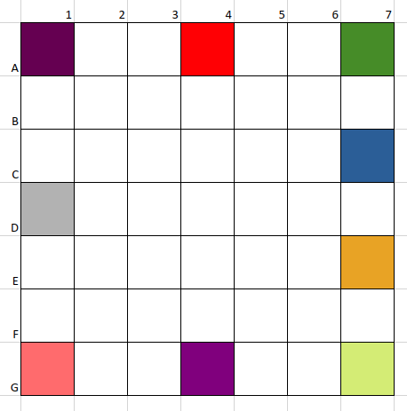

### Data structures
Mention classes ( copy and paste code?)

Welcome dragon-fire-fly,

This is the Code Institute student template for deploying your third portfolio project, the Python command-line project. The last update to this file was: **August 17, 2021**

## Reminders

* Your code must be placed in the `run.py` file
* Your dependencies must be placed in the `requirements.txt` file
* Do not edit any of the other files or your code may not deploy properly

## Creating the Heroku app

When you create the app, you will need to add two buildpacks from the _Settings_ tab. The ordering is as follows:

1. `heroku/python`
2. `heroku/nodejs`

You must then create a _Config Var_ called `PORT`. Set this to `8000`

If you have credentials, such as in the Love Sandwiches project, you must create another _Config Var_ called `CREDS` and paste the JSON into the value field.

Connect your GitHub repository and deploy as normal.

## Constraints

The deployment terminal is set to 80 columns by 24 rows. That means that each line of text needs to be 80 characters or less otherwise it will be wrapped onto a second line.

-----
Happy coding!