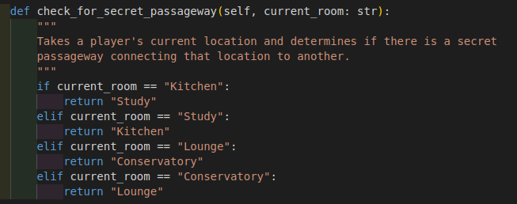

# Cluedo

<!-- Scrrenshot of finished project -->

## Live site
[PyClue on Heroku](https://pyclue.herokuapp.com/)

## Repository

[Cluedo GitHub Repo](https://github.com/dragon-fire-fly/cluedo)

## Objective
"PyClue" is a one player Python terminal game based upon the classic detective game Cluedo. More information about the history and gameplay of Cluedo can be found on the [Cluedo wikidpedia page](https://en.wikipedia.org/wiki/Cluedo).

## Story
You were invited to a dinner party at the esteemed Dr Black's country Mansion for an evening of dinner, drinks, dancing and debauchery. 

Unfortunately, as the clock struck midnight, a piercing scream reverberated throughout the Manor, caused by the discovery of Dr Black's body. He has been murdered in cold blood.

You and the other five guests have gathered around Dr Black's body in the hallway, but something seems strange. This is clearly not the scene of the crime.

In addition, a series of objects found around the Manor have been collected as potential murder weapons and lie strewn around the body.

Your role now is to figure out WHO committed the crime, WHICH item was used and WHERE the murder took place.... and hopefully prove your innocence!

Roll the die to move around the Mansion and perform investigations to eliminate suspects, items and locations in order to figure out the details of this murder most foul.

Once you think you know WHO, WHAT and WHERE, you may make an accusation. Be careful though, if you guess incorrectly, perhaps suspicion will fall on YOU. 

Now what are you waiting for? There's no time to lose!

## Brief

## User Experience

### Wireframes?

### Colour scheme?

## Logic
### Flow diagram
A basic flow diagram of the game mechanics is shown below.  

### Gameboard layout
The layout of rooms in the mansion in the original cluedo game are as follows:  

A simplified gameboard to be used in the PyClue game was designed on a grid system as follows:  

## Features

### Game Features
#### Main Menu
#### New game (with and without story)
#### View Rules

### Playing the game
#### Choose Character
<!-- Different character = diff starting location? -->
#### View Scorecard

#### Update Scorecard

#### Choose a room (inc. Secret Passageway)
- room distances are calculated and displayed (inc. secret passageway rooms)
- Player prompted for choice
- Player moved to or towards (depending on if enough moves available) chosen room or stays in current room if preferred

#### Investigation phase
- Choose a suspect
- Choose a weapon
- Input validation
- AI player shows card
- Scorecard updated

#### The Accusation
- Choose a suspect
- Choose a weapon
- Choose a room
- Input validation
- Check if player definitely wants to submit

#### Favicon
A magnifying glass icon was chosen as the favicon for the Heroku terminal program

### Python Coding Features
#### Game constants

 Click to expand and view the constants used for the game. These are lists, dictionaries and other iterables that are used by the game functions to set the initial (or in some cases updated) values for the game:

| .py file  | name  | img  |
|---|---|---|
| setup.py  | Room Locations  |   |
| setup.py  | Cards  |   |
| setup.py  | Dealt cards (empty)  |    |
| setup.py  | Suspects  |    |
| setup.py  | Weapons  |    |
| setup.py  | Rooms  |    |
| setup.py  | Game Board  |    |
|  setup.py | Scorecard/investigation card  |    |

#### OOP
Classes were made for:
- Gameboard
- Player
- AI Players
- Card deck
- Scorecard

The code for each class is discussed below:

 Click to expand and view the Gameboard class code:

| function  | description  | img  |
|---|---|---|
| __ init __()   |  |  |
| update_player_location()  |   |   |
| current_player_location()  |   |   |
| calculate_distance()  |   |   |
| room_distances()  |   |   |
| which_room()  |   |   |
| choose_room() |   |   |
| check_for_secret_passageway()  |   |   |

 Click to expand and view the Player class code:

| function  | description  | img  |
|---|---|---|
| __ init __()   |  |   |
| choose_character()  |   |   |
| set_starting_location()  |   |   |
| move_player()  |   |    |
| choose_investigation_cards()  |   |   |
| make_accusation()  |   |   |
| roll_die()  |   |   |

 Click to expand and view the AI Player class code:

| function  | description  | img  |
|---|---|---|
| __ init __()  |   |   |

 Click to expand and view the Cards class code:

| function  | description  | img  |
|---|---|---|
| __ init __()  |   |   |
| shuffle_cards()  |   |   |
| deal_cards()  |   |   |
| check_murder_envelope()  |   |   |

 Click to expand and view the Scorecard class code:

| function  | description  | img  |
|---|---|---|
| __ init __()  |   |   |
| show_scorecard()  |   |   |
| update_scorecard()  |   |   |

#### Custom Modules
The Classes were saved into seperate .py files which were then imported into setup.py to be instantiated as objects to be imported and used in the main run.py file.

 Click to expand and view the code for the setup.py functions:

| function  | description  | img  |
|---|---|---|
| main_menu()  |   |   |
| show_rules()  |   |   |
| game_setup()  |   |   |
| generate_ai_characters()  |   |   |
| story()  |   |   |

 Click to expand and view the code for the run.py functions:

| function  | description  | img  |
|---|---|---|
| main_game_loop()  |   |   |
| investigate()  |   |   |
| end_of_turn()  |   |   |

 Click to expand and view the code for the validation.py functions:

| function  | description  | img  |
|---|---|---|
| number_input_validation  |   |   |
| number_dict_input_validation  |   |   |
| y_n_input_validation  |   |   |
| clear  |   |   |

### Future Features
- save/load functionality
- difficulty setting
- multiplayer/ AI players playing

## Technologies Used
- [Python3](https://www.python.org/) as core programming language
- [Visual Studio Code](https://code.visualstudio.com/) - for offline code editing
- [Heroku](https://www.heroku.com) - for cloud hosting of the project
- [Draw.io](https://app.diagrams.net/) for creatinf flow diagram
- [Venv virtual environment](https://docs.python.org/3/library/venv.html) - for creating a virtual environment to work in
- Github

Python Modules used:
- random (randint - for generating random integers)
- time (sleep - for creating pauses between print statements)
- os (system("clear") - to clear the contents of the terminal)
- copy (deepcopy - for creating copies of variables)
- tabulate (tabulate - for creating tables)

## Testing
### Manual testing
### PEP-8 Compliance

## Bugs
### Resolved Bugs
### Outstanding Bugs

## Deployment
### Github
- Cloning

### Heroku

## Credits

logo:
http://patorjk.com/software/taag/#p=display&f=Bloody&t=PyClue%0A%0A%0A%0A

favicon:
https://game-icons.net/1x1/lorc/magnifying-glass.html#download
https://favicon.io/

## Rules:
1. The murderer, murder weapon and murder location have been placed inside the "murder envelope"
2. Roll the dice or use a secret passage each turn to move from room to room. You may move up, down or sideways, but not diagonally. 
3. On your turn, if you are in a room, you may question the other suspects about any suspect, any weapon and the location you are currently at. 
4. Starting with the player to your left, if that player has one of the three suggested cards, they must show you one. If they don't have any cards, they player to their left is questioned next, and so on.
5. Once you feel certain that you know the murderer, murder weapon and room, you may make an accusation. You may only make one accusation per game.

## Setup

setup.py contains all information pertinent to the setup of the game. This includes:

1. instatiating 
    - the gameboard class
    - the cards class
    - player class
    - AI player class
2. containing all lists and dictionaries for game setup

## General Gameplay
Each turn consists of the following 11 steps:
### Player turn:
1. minus one hour from the game clock
2. player rolls dice and decides whether to move or stay in the room
    - player.move() (inc. player.roll_die()) - generates new player co-ordinates
    - gameboard.update() - update to new player location
3. if player moves to hallway, turn ends
    - gameboard.which_room() - returns which room player is in (or hallway)
4. if player in room, player chooses a suspect and weapon to investigate
    - player.investigate() - chooses three cards to compare (1 x suspect, 1 x weapon, 1 x room)
5. The three chosen cards (suspect, weapon, room) are compared to the next player (index 0 in player list)
    - for each AI player, check_cards()
6. if the next player has one or more investigation cards, they must show one
    - AI player show_card()
7. if the next player has none of the investigation cards, the next player's (index 1 in player list) cards are compared to investigation cards
    - AI player check_cards()
8. Play continues in this manner until a card is shown. Once a card is shown, turn ends
    - AI player show_card()
9. If no cards are shown by any player, turn still ends
10. Investigation card is updated with the card shown (if any)
    investigation_card.update()
11. Next turn begins...

## Potential OOP objects:
- Game board
- Player(s)/ player piece(s)
- Cards
- Dice
- Scorecard/ tracker

## Functions
### Gameboard

### Data structures
Mention classes ( copy and paste code?)

Welcome dragon-fire-fly,

This is the Code Institute student template for deploying your third portfolio project, the Python command-line project. The last update to this file was: **August 17, 2021**

## Reminders

* Your code must be placed in the `run.py` file
* Your dependencies must be placed in the `requirements.txt` file
* Do not edit any of the other files or your code may not deploy properly

## Creating the Heroku app

When you create the app, you will need to add two buildpacks from the _Settings_ tab. The ordering is as follows:

1. `heroku/python`
2. `heroku/nodejs`

You must then create a _Config Var_ called `PORT`. Set this to `8000`

If you have credentials, such as in the Love Sandwiches project, you must create another _Config Var_ called `CREDS` and paste the JSON into the value field.

Connect your GitHub repository and deploy as normal.

## Constraints

The deployment terminal is set to 80 columns by 24 rows. That means that each line of text needs to be 80 characters or less otherwise it will be wrapped onto a second line.

-----
Happy coding!