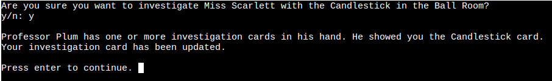
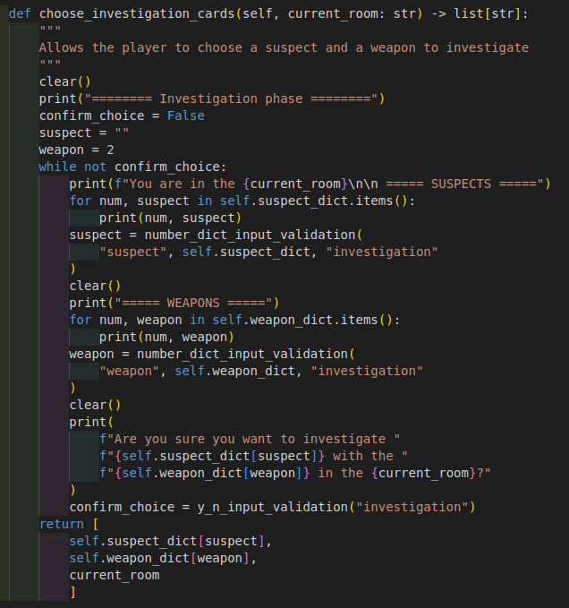

# Cluedo
## Live site
[PyClue on Heroku](https://pyclue.herokuapp.com/)

## Repository

[Cluedo GitHub Repo](https://github.com/dragon-fire-fly/cluedo)

## Objective
"PyClue" is a one player Python terminal game based upon the classic detective game Cluedo. More information about the history and gameplay of Cluedo can be found on the [Cluedo wikidpedia page](https://en.wikipedia.org/wiki/Cluedo).  

The objective of PyClue is to provide entertainment to users and provides value to users who want an interactive one player game

## Story
You were invited to a dinner party at the esteemed Dr Black's country Mansion for an evening of dinner, drinks, dancing and debauchery. 

Unfortunately, as the clock struck midnight, a piercing scream reverberated throughout the Manor, caused by the discovery of Dr Black's body. He has been murdered in cold blood.

You and the other five guests have gathered around Dr Black's body in the hallway, but something seems strange. This is clearly not the scene of the crime.

In addition, a series of objects found around the Manor have been collected as potential murder weapons and lie strewn around the body.

Your role now is to figure out WHO committed the crime, WHICH item was used and WHERE the murder took place.... and hopefully prove your innocence!

Roll the die to move around the Mansion and perform investigations to eliminate suspects, items and locations in order to figure out the details of this murder most foul.

Once you think you know WHO, WHAT and WHERE, you may make an accusation. Be careful though, if you guess incorrectly, perhaps suspicion will fall on YOU. 

Now what are you waiting for? There's no time to lose!

## User Experience
As a user, when playing PyClue, I would like to be able to...
- optionally view the rules  
- optionally view the backstory  
- choose a character  
- easily move around the game board  
- ask other players whether they have a card by 'investigating'  
- keep track of which cards I have and which cards I have been shown (and by whom)  
- make an accusation when I think I know the correct cards  

## Planning and Logic
### Flow diagram
A basic flow diagram of the game mechanics is shown below. All user input is validated before being accepted. These validation steps are not shown on the flow chart. Additionally, the player has the opportunity to make an accusation at the end of each round.  

### Gameboard layout
The layout of rooms in the mansion in the original cluedo game is as follows:  

A simplified gameboard to be used in the PyClue game was designed on a grid system as follows:  

Each square on the board has a set of x y "co-ordinates" contained within a tuple. In this way, movement between rooms and whether a player is in a room can be determined.

### Jupyter Notebook
A Jupyter notebook was created before the project was started with ideas and small pieces of practice code for the project. This Jupyter notebook can be found [here](documentation/planning_files/planning.ipynb).

## Features

### Game Features  

Below are screenshots of the game being played in the Heroku deployed terminal to show the game features. Features of the code can be found in the [Python Coding Features](#python-coding-features) section below.

**Main Menu**  
The main menu displays the "PyClue" logo and three options - play game (with story), play game (skip story) and view rules.  

**Story**  
The story prints in seven parts with the logo and a "typewriter" type effect.  
  
  

**View Rules**  
The rules print in five parts with the logo and a "typewriter" type effect.  
  

### Playing the game
**Choose Character**  
The user is able to pick one from the six characters available from the original Cluedo. User input is accepted as a number or the name of the character typed (case sensitive and requiring . where present)  

**View Investigation Card**  
The investigation card can be viewed at almost all times throughout the game and marks which player has shown which card so far to aid future investigations.  

The table format for displaying the investigation card was later changed to make it more readable by adding lines between the rows. This made the scorecard no longer fit neatly into the Heroku terminal, but aids greatly with user experience and playability.
  

The investigation card is updated each time another player shows a card.

**Choose a room (inc. Secret Passageway)**  
- room distances are calculated and displayed (inc. secret passageway rooms)  
- Player prompted for choice  
  

- Player moved to or towards (depending on if enough moves available) chosen room or stays in current room if preferred  

**Investigation phase**  
- Players are invited to choose a suspect...  
  
- ... and a weapon  
  
- Input validation checks that the user typed answer is acceptable  
  
- AI player shows card  

- The scorecard is updated  
  

**The Accusation**  
- Players are invited to choose a suspect...  
  
- ... a weapon ... 
  
- ... and a room  
  
- Input validation checks that the user typed answer is acceptable  
  
- Check if player definitely wants to submit  
  
- Game evaluates whether you picked the correct cards and displays win/lose  
(see below)

**End of Game**  
The game has three possible endings  
1. correctly guessing the murder cards  
  

2. Incorrectly guessing the murder cards  
  

3. Lose message for running out of time/incorrect choice   
 

End message  
Each end of game scenario ends by thanking the player and inviting them to play again by pressing run program in the Heroku window.

 

**Favicon**  
A magnifying glass icon was chosen as the favicon for the Heroku terminal program  
  

### **Python Coding Features**

The general gameplay is summarised into 12 points as shown below:  

**Player turn:**  
1. play starts with 24 hours on the game clock. One hour is removed from the clock each turn.
    - within run.py
2. player rolls dice and decides whether to move or stay in the room
    - `player.roll_die()`
    - `player.move_player()` - generates new player co-ordinates
    - `gameboard.update_player_location()` - update to new player location
3. if player moves to hallway, turn ends
    - `gameboard.which_room()` - returns which room player is in (or hallway)
4. if player in room, player chooses a suspect and weapon to investigate
    - `player.choose_investigation_cards()` - chooses three cards to compare (1 x suspect, 1 x weapon, 1 x room)
5. The three chosen cards (suspect, weapon, room) are compared to the next player (index 0 in player list)
    - `investigate()` checks chosen cards against each AI player's hand
6. if the next player has one or more investigation cards, they must show one
    - part of `invetigate()`
7. if the next player has none of the investigation cards, the next player's (index 1 in player list, then index 2, etc.) cards are compared to investigation cards
    - part of `investigate()`
8. Play continues in this manner until a card is shown. Once a card is shown, end of turn sequence initiates
    - `end_of_turn()`
9. If no cards are shown by any player, turn still ends
10. Investigation card is updated with the card shown (if any)
    - `scorecard.update_scorecard()`
11. Option to make an accusation, choosing one each suspect, weapon and room
    - `player.make_accusation()`
12. Next turn begins...  

A more detailed look at each of the code features is shown below:  

#### Game constants  

 Click to expand and view the constants used for the game. These are lists, dictionaries and other iterables that are used by the game functions to set the initial (or in some cases updated) values for the game:

| .py file  | name  | img  |
|---|---|---|
| setup.py  | Room Locations  |   |
| setup.py  | Cards  |   |
| setup.py  | Dealt cards (empty)  |    |
| setup.py  | Suspects  |    |
| setup.py  | Weapons  |    |
| setup.py  | Rooms  |    |
| setup.py  | Game Board  |    |
|  setup.py | Scorecard/investigation card  |    |

#### OOP
Classes were made for:
- Gameboard
- Player
- AI Players
- Card deck
- Scorecard

The code for each class is discussed below:

 Click to expand and view the Gameboard class code:

- **__ init __()**   
The Gameboard init method initializes the room dictionary (as room: (x, y)) and the current player location (as a [x, y] list).  
  
- **update_player_location()**   
This method receives a new location (as [x, y] list) and updates the current location stored within the Gameboard class.  
  
- **current_player_location()**  
This method simply returns the current location stored within the Gameboard class.  
  
- **calculate_distance()**  
This method takes the co-ordinates of two points (either as a [x, y] list or an (x, y) tuple) and calculates and returns the total distance between the two points as an int. The calculation adds all the spaces on the x and y axis as players are not allowed to move diagonally in PyClue.   
  
- **room_distances()**   
This method starts with a dictionary of the rooms and a default value of 0 spaces for each room. The method then updates the distance (dictionary value) by calling the calculate_distance() method for each room in the dictionary and returns it.   
  
- **which_room()**  
This method evaluates whether the co-ordinates of the player's current location matches the co-ordinates of any room in the room dictionary. If so, it returns the name of the room. Otherwise, returns "hallway".    
  
- **choose_room()**  
This method calls the room_distances() method and the check_for_secret_passageways() method and displays the rooms with their corresponding distances to the user and prompts for a choice. The choice is validated with the number_input_validation() function and the desired room and updated room_distances library are returned.  
  
- **check_for_secret_passageway()**  
This method checks whether the space the user is currently in is a room, and if so, checks whether that room has a secret passageway. The Kitchen and Study are linked with a passageway, as are the Lounge and the Conservatory. If a passageway is present, the name of the connected location is returned.
  

 Click to expand and view the Player class code:

- **__ init __()**  
The Player class init method initializes the suspect, weapon and room dictionaries as a number (str type e.g. "3") as the key and the name of the suspects, weapons or rooms as the values.  
  
- **choose_character()**  
Calls the number_dict_input_validation() method to prompt the user to choose a character. Returns the name of the character the user selected from the relevant value from the suspect dictionary.    
  
- **set_starting_location()**  
Assigns the starting location for whichever player the user selected. Updates the gameboard object in the setup file with this location. Returns nothing.  
  
- **roll_die()**  
Simply returns a random number between 1-6 using the randomint() method from the random class. 
  
- **move_player()**  
This method takes six arguments (current player location, desired room, current room, value of die roll, room distances dictionary and the room dictionary) in order to return the new player location after a player has chosen to move (or not to move!)  
  
    First, the method evaluates whether the user has rolled enough on the die to make it to the desired room from the current room. If so, the player location is updated to the desired room. If the desired room is different from the current room, it prints that the user is "walking" there. If the desired room is the same as the current room, it prints "you have chosen to remain in the <desired_room>".  
  
    If the user has not rolled enough to reach the desired room, they are given the option to move towards the desired room (by the number of spaces in the die roll), or to stay in the current room. If they choose to move towards the desired room, the player will be moved up/down by one space (depending on the direction of the desired room), then left/right by one space (depending on the direction of the desired room). Each time the player moves, one is subtracted from the die roll, until all the moves have been used up. The function then returns the co-ordinates of the new space.  

   
- **choose_investigation_cards()**  
Uses suspect and weapon dictionaries to allow user to select a suspect and weapon for their investigation. The room for the investigation is determined by the current room, which is passed as an argument into this method. The method returns the suspect, weapon and current room as a list.   
  
- **make_accusation()**  
The make accusation method is similar to the choose investigation cards method detailed above, but allows the user to also choose any room. The accusation can be performed from anywhere, once the user reaches the end of their turn. The method uses the y/n input validation method, as well as the number dictionary input validation method to ensure that user input is valid. The method returns the names of the suspect, weapon and room as a list.  
  

 Click to expand and view the AI Player class code:

- __ init __()  
The AI player class only has an init method which initializes the name of the player and the list of three cards in their hand.  
  

 Click to expand and view the Cards class code:

- **__ init __()**  
The init method initializes the cards to be dealt, the dealt cards dictionary (which starts as an empty list for each character) and the murder envelope, which starts as a list of empty strings.  
  
- **shuffle_cards()**  
The shuffle cards method takes a list of strings and used the shuffle() method from the random module to shuffle the deck and return it.  
  
- **deal_cards()**  
The deal cards method takes each of the sub lists from the cards list and calls the shuffle cards method. The method then pops the last card from each list to compile the murder envelope. The method then adds the remaining cards together into one deck and calls the shuffle_cards() method again. The shuffled cards are then assigned to each of the keys in the dealt_cards dictionary until all shuffled cards have been assigned.  
  
- **check_murder_envelope()**  
This method takes the player's guess as a list of strings (suspect, weapon, room) and checks each card from the guess against each card in the murder envelope. If all three cards match (using the "and" logical operator in the conditional if statement), a win statement is printed and "win" is returned. Otherwise, the wrong guess and lose statement is printed and "lose" is returned.  
  

 Click to expand and view the Scorecard class code:

- **__ init __()**  
The init method initializes the scorecard as a list of lists (where each list contains each row of data)  
  
- **show_scorecard()**  
The show scorecard method uses the imported tabulate module to display the list of lists as a table. The tabulate style chosen is "fancy_grid" with an alignment of "center".  
  |
- **update_scorecard()**  
The update scorecard method takes as arguments the character who just showed a card and the card that they showed. The method then saves the index of the character from the first list, which acts as the column headings, as "char_num". The index of the list which contains the card is then saved as the "list_index" variable.
    These variables are combined to mark with an "x" the intersection between the character column and the card row by using `self.scorecard[list_index][char_num] = "x"`.  
  |

#### Custom Modules
The Classes were saved into seperate .py files which were then imported into setup.py to be instantiated as objects to be imported and used in the main run.py file.

 Click to expand and view the code for the setup.py functions:

- **main_menu()**  
The main menu consists of a while loop which uses the number_input_validation() method to request an input from the user to ascertain whether they want to start the game with or without the story or if they want to view the rules first.  
  
- **show_rules()**  
The rules are broken into five paragraphs. Each rule is sequentially added to a "rules list" which is printed (along with the logo) on each iteration of the printing loop. During each loop, the "new" rule is printed with a typewriter effect by using the sleep() method from the time module to pause for 0.025 seconds between each letter. The flush=True parameter is used to ensure that the print function prints each letter seperately.
  
- **game_setup()**  
The `game_setup()` function calls the `player.choose_character()` method to prompt the user to pick a character to play as. The starting location for that character is then assigned using the `player.set_starting_location(chosen_character)` method. The cards are then dealt with `cards.deal_cards()` and the user's hand is assigned with `user_hand = DEALT_CARDS.pop(chosen_character)` and these cards added to the investigation/scorecard with 
`for card in enumerate(user_hand):
        scorecard.update_scorecard(chosen_character, user_hand[card[0]])`.  
    The other 5 characters are generated by calling the `generate_ai_characters()` function (detailed below).  
  
- **generate_ai_characters()**  
The generate_ai_characters() function contains an if statement for each character to check whether the cards from the "DEALT_CARDS" list still exist in the dictionary. If so, an ai character is generated for that character and the cards in the DEALT_CARDS dictionary are assigned. If the `DEALT_CARDS.get(<character_name>)` returns false, this means that the cards have already been removed from the `DEALT_CARDS` list because it is the character the user chose to play as. In this case, the generation of ai character step is skipped (and because the `.get()` method is being used, no error is thrown).  
    The list of ai_character objects is returned from this function.
  
- **story()**  
The story is broken into seven paragraphs to make it easier to read and a nicer user experience. Each part of the story is sequentially added to a "storyboard" which is printed (along with the logo) on each iteration of the printing loop. During each loop, the "new" part of the story is printed with a typewriter effect by using the sleep() method from the time module to pause for 0.025 seconds between each letter. The flush=True parameter is used to ensure that the print function prints each letter seperately, rather than printing all at once for efficiency, as is the default print behaviour.  
  

 Click to expand and view the code for the run.py functions:

- main_game_loop()  
The `main_game_loop()` function calls the `gameboard.current_player_location()` method to obtain the player's current location, which is fed into the `gameboard.which_room()` method to obtain the current room, which is then displayed to the user. The die is then automatically rolled using the `player.roll_die()` method and the rooms with their distances are displayed by calling the `gameboard.choose_room()` method.  
    The player then moves based on the user input to the `player.move_player()` method and the current location is updated by calling the `gameboard.update_player_location(new_player_location)` method.  
    If the player is in a room (determined by the result of `if current_room in ROOM_LOCATIONS:`), the user is invited to choose investigation cards for the round by calling `player.choose_investigation_cards(current_room)` and then calling `investigate(investigation_list)` on the chosen cards.  
    If the player is not in a room, the turn ends without an investigation phase. 

  
- investigate()  
The `investigate()` method compares the three cards chosen during the `main_game_loop()` to the cards in the ai character hands. For each of the five characters in the `ai_character_list`, each of the three `investigation_cards` is compared in turn to each card in each character's hand. This comparison is run starting at the last character and ending at the first character in the list by using list slicing [::-1]. The function then prints the name of the character who shows the card, and which card they are showing (if any character has any card)  
  
- end_of_turn()   
At the end of the turn, the user is asked whether they would like to end their turn, make an accusation or view the investigation card. If they choose to make an accusation, the `player.make_accusation()` method is called and then the `cards.check_murder_envelope(accusation)` method is called to compare the guessed cards to the "murder envelope".   
  

 Click to expand and view the code for the validation.py functions:

- number_input_validation()  
Takes the number of options as an argument and prompts the user for a number between 1 and the number of options. If the user input is valid, the user choice (as a string) is returned. Otherwise, the user is informed that their answer was not valid and is prompted for a new input.  
  

- room_choice_input_validation()
Similar to `number_input_validation()` above but specifically for choosing a room.

- number_dict_input_validation()  
Accepts a string value ("character", "suspect", "weapon" or "room"), a relevant dictionary (suspect_dict, weapon_dict or room_dict) and optionally a phase ("investigation" or "accusation"). The user is prompted for an input relevant to the arguments passed. If the input is either a key or a value from the relevant dictionary, the key of the dictionary is returned. If the input is invalid, the user is informed and requeted for a new input.  
  

- y_n_input_validation()  
This function prompts the user for a y/n answer (as a str type). The function asssesses whether the (lowercased) user input is in the list of "yes" words or "no" words. If the user input is in neither list, it informs the user that their answer was not valid and requests a new answer. The function returns true or false, and if false, also prints an appropriate message.  
  
- clear()  
Clear simply performs a terminal clearing function using the linux specific clearing method from the os module   

### Future Features
- save/load functionality
- difficulty setting
- multiplayer/ AI players playing
- more versitility in acceptable user input (e.g. "col mustard" or "white" instead of needing to be "Colonel Mustard" or "Mrs. White")

## Technologies Used
- [Python3](https://www.python.org/) as core programming language
- [Visual Studio Code](https://code.visualstudio.com/) - for offline code editing
- [Heroku](https://www.heroku.com) - for cloud hosting of the project
- [Draw.io](https://app.diagrams.net/) for creating flow diagram
- [Venv virtual environment](https://docs.python.org/3/library/venv.html) - for creating a virtual environment to work in
- [GitHub](https://github.com/) as a code hosting platform
- [Git](https://git-scm.com/) for source code management
- Code annotations for determining which data type can be received and which is returned  (e.g. `def y_n_input_validation(phase: str) -> bool:`)

Python Modules used:
- random (randint - for generating random integers)
- time (sleep - for creating pauses between print statements)
- os (system("clear") - to clear the contents of the terminal)
- copy (deepcopy - for creating copies of variables)
- tabulate (tabulate - for creating tables)

## Testing
Details of manual and PEP8 compliance testing may be found in the dedicated [TESTING document](https://github.com/dragon-fire-fly/cluedo/blob/main/TESTING.md).

## Bugs
During this project, bugs were tracked using the "Issues" tab in GitHub. A summary of the closed bugs is shown below:

The details of each of the resolved and outstanding bugs can be viewed by following the links provided below:

### Resolved Bugs
1. [Always printing that user is in the hallway bug](https://github.com/dragon-fire-fly/cluedo/issues/2) (issue #2)
2. [Secret passageway bug](https://github.com/dragon-fire-fly/cluedo/issues/3) (issue #3)
3. [Number not recognised as valid input](https://github.com/dragon-fire-fly/cluedo/issues/4) (issue #4)
4. [Cards are shown by last AI player with relevant card instead of first bug](https://github.com/dragon-fire-fly/cluedo/issues/5) (issue #5)
5. ['Colonel Mustard not in list' bug](https://github.com/dragon-fire-fly/cluedo/issues/6) (issue #6)
6. [Game crashing if the murder cards are investigated bug](https://github.com/dragon-fire-fly/cluedo/issues/7) (issue #7)
7. [Cards in the "murder envelope" always the same bug](https://github.com/dragon-fire-fly/cluedo/issues/8) (issue #8)
8. [KeyError when selecting a room](https://github.com/dragon-fire-fly/cluedo/issues/11) (issue #11)
9. [Printing "You chose to stay in the hallway" instead of stay in current room](https://github.com/dragon-fire-fly/cluedo/issues/12)(issue #12)

### Outstanding Bugs
1. [Sometimes end in wrong room bug](https://github.com/dragon-fire-fly/cluedo/issues/9) (issue #9)  
2. [Heroku terminal bug](https://github.com/dragon-fire-fly/cluedo/issues/10) (issue #10)

## Deployment
### Github
Following these steps will allow you to clone a repository and open it in your local IDE, for example Visual Studio Code, Eclipse or NetBeans:

1. Locate the repository of the [project you would like to copy](https://github.com/dragon-fire-fly/cluedo).
2. Click the "Code" button to access a drop down menu.
3. Ensuring that HTTPS is selected, select the copy button (as shown in the screenshot below) to copy the URL of the repository of interest.
4. Open your local IDE and change the current working directory in GitBash to the desired location for the new repository.
5. In the command line, type 'git clone' and paste the URL obtained earlier from GitHub.

Alternatively, you can create a local copy of this repository, by typing the follow into your IDE terminal:

`git clone https://github.com/dragon-fire-fly/cluedo.git`

Or, if using Gitpod, you can click below to create your own workspace using this repository.

### Heroku
1. To deploy a project using Heroku, first [create an account and log in](https://www.heroku.com). Create a new app by using the drop down menu.  
  
2. Create a new app by choosing a name and the appropriate region.    
3. The app information can be found by accessing the "settings" tab.    
4. In the config vars, a key of "PORT" and a value of "8000" should be set as a config var    
5. Python and NodeJS should be selected as buildpacks.    
6. In the deploy tab, GitHub can be selected as the deployment method and the appropriate GitHub account can be linked.    
7. Automatic deployment can be selected, if wished...    
8. .. or apps can be manually deployed with the manual deploy function.    

## Credits
### Content

Logo source:
http://patorjk.com/software/taag/#p=display&f=Bloody&t=PyClue%0A%0A%0A%0A

Favicon image source:
https://game-icons.net/1x1/lorc/magnifying-glass.html#download
https://favicon.io/

### Acknowledgements
A huge thank you to my Mentor Tim Nelson for his continued support, enthusiasm, advice and debugging help!  
I would also like to thank my peers in the May 2022 cohort at Code Institute for support and always providing encouragement and inspiration. Special thanks go to Kelly Hutchison and Warwick Hart for play testing and providing feedback :)

Finally, thanks go to my husband for his understanding, patience and partial play testing (even if his conclusion was "one player Cluedo is really boring"! :D)

