[Click here](https://github.com/dragon-fire-fly/cluedo/blob/main/README.md) to return to the main PyClue README.

# Testing

## Manual Testing

### Main Menu
|What is being tested?   |  What is the input? |  Expected response? | Works as expected?  | Screenshot  |
|---|---|---|---|---|
| Select option 1  | "1"  | plays game with story  | yes  | 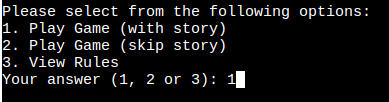 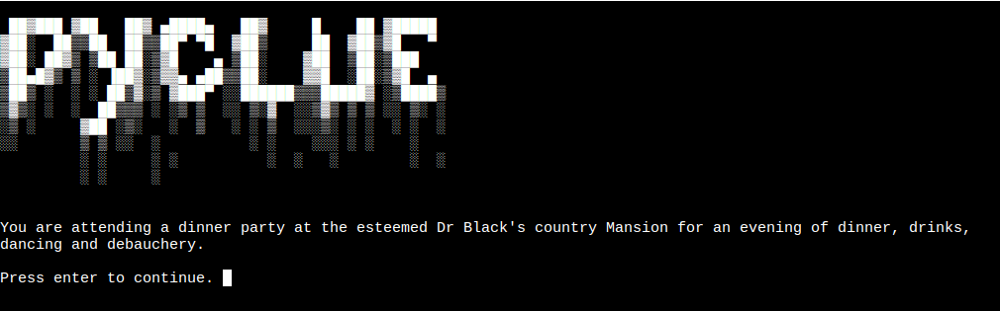 |
| Select option 2  | "2"  | plays game without story  | yes  | 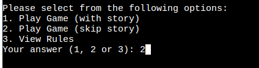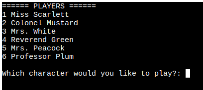  |
| Select option 3  | "3"  | displays rules  | yes  | 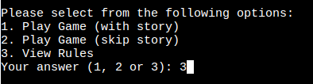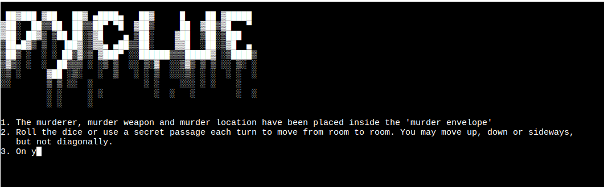  |
| Input validation (too many spaces)  | " 1 " (with lots of spaces)  | plays game with story  | yes  | 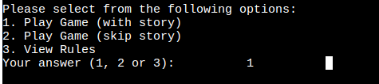 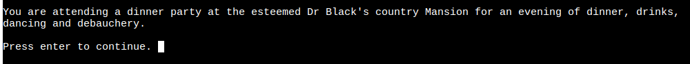  |
| Input validation (number outside range)  | "4"  | input not accepted  | yes  | 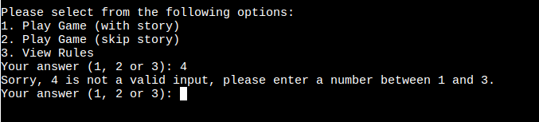 |
| Input validation (invalid string)  | "cat"  | input not accepted  |  yes | 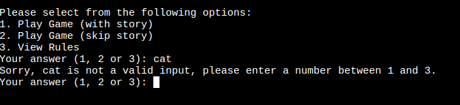  |

### Player Selection

|What is being tested?   |  What is the input? |  Expected response | Works as expected?  | Screenshot  |
|---|---|---|---|---|
| Select character 1  | "1"  |  select Miss Scarlett | yes  | 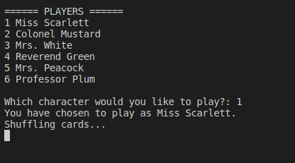  |
| Select Miss Scarlett  | "Miss Scarlett"  | select Miss Scarlett  | yes | 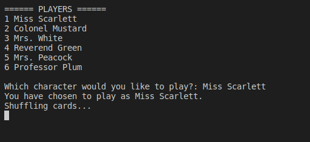  |
| Select character 2  | "2"  | select Colonel Mustard  | yes  | 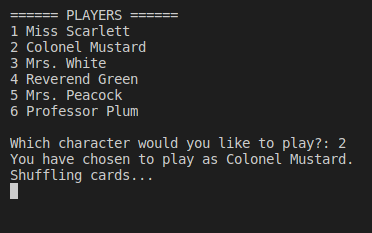  |
| Select character 3  | "3"  | select Mrs. White  | yes  | 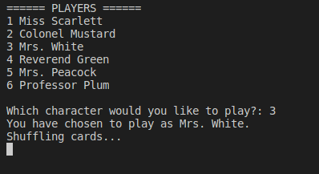  |
| Input validation (too many spaces)  | "  4  " (with many spaces)  | select player 4 (Reverend Green)  | yes  | 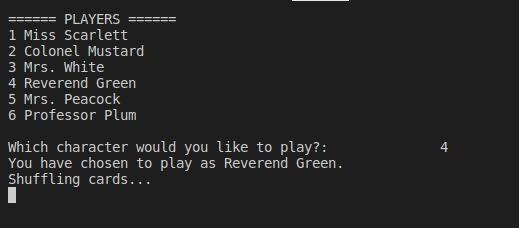  |
| Input validation (number outside range)  | "7"  |  input not accepted | yes  | 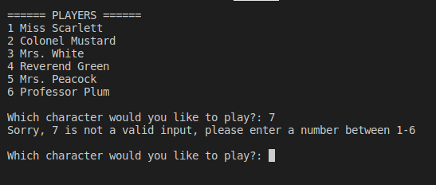  |
| Input validation (invalid string)  | "cat"  | input not accepted |  yes  | 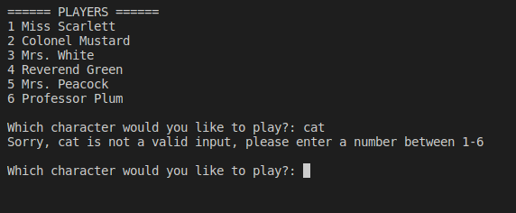  |
| Input validation (does not exist)  | "Dr Black" | input not accepted  | yes  | 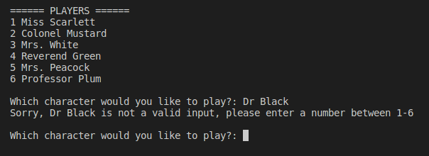  |
| Input validation (shortened name)  | "col mustard  |  input not accepted (only accepts specific dictionary keys/values) |  yes  | 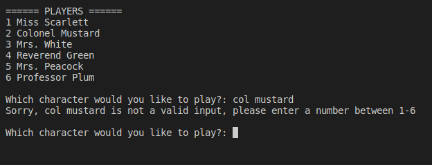  |

### Investigation Card

|What is being tested?   |  What is the input? |  Expected response | Actual response  | Screenshot  |
|---|---|---|---|---|
| Open investigation card with "i"  | "i"  | opens investigation card  | yes  |  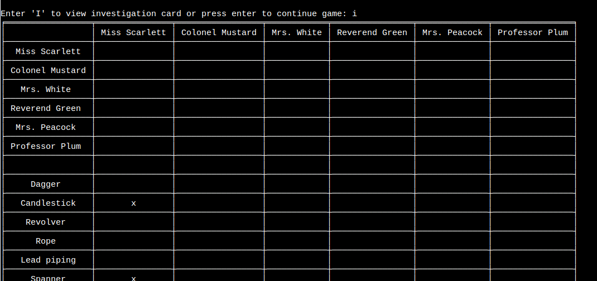 |
| Open investigation card with "I"   | "I"  | opens investigation card   | yes  |   |
| Input validation - open investigation card with "investigation"  | "investigation"  |  input not accepted  | yes  | 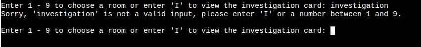  |
| Input validation - open investigation card with number  | "0"  |  input not accepted  | yes  | 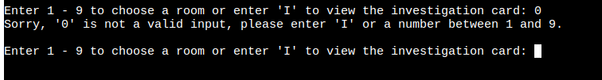  |
| Update investigation card when card shown  | completes an investigation round  | card shown and "x" placed in correct place in investigation card  |  yes |  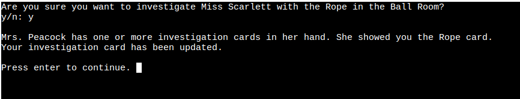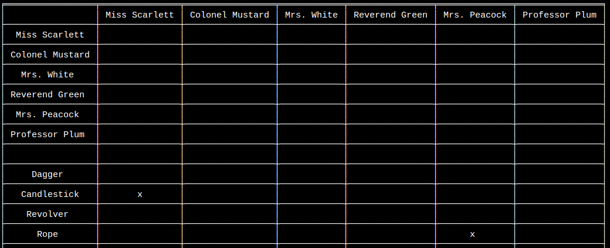 |
| Correct cards added at start of game  | select character  |  The three cards printed at the start should correcpond to the three cards marked on the investigation card | yes  | 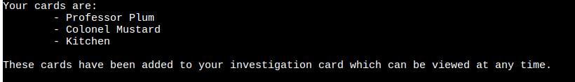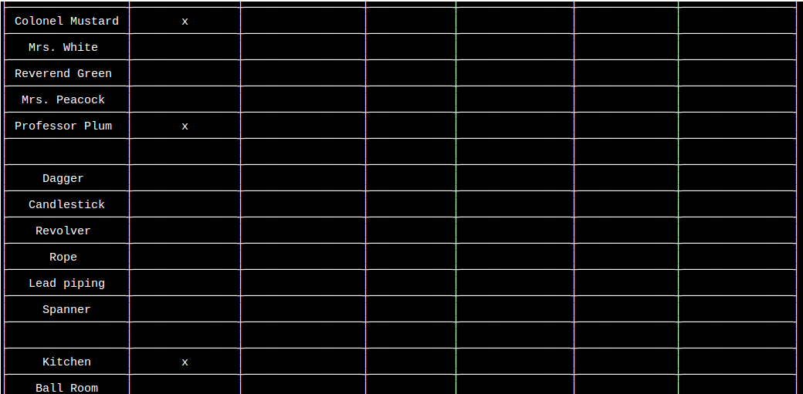  |
|   |   |   | yes  |   |
|   |   |   | yes  |   |
|   |   |   | yes  |   |
|   |   |   |  yes |   |

### 

|What is being tested?   |  What is the input? |  Expected response | Actual response  | Screenshot  |
|---|---|---|---|---|
|   |   |   | yes  |   |
|   |   |   | yes  |   |
|   |   |   | yes  |   |
|   |   |   | yes  |   |
|   |   |   |  yes |   |
|   |   |   | yes  |   |
|   |   |   | yes  |   |
|   |   |   | yes  |   |
|   |   |   | yes  |   |
|   |   |   |  yes |   |

|What is being tested?   |  What is the input? |  Expected response | Actual response  | Screenshot  |
|---|---|---|---|---|
|   |   |   | yes  |   |
|   |   |   | yes  |   |
|   |   |   | yes  |   |
|   |   |   | yes  |   |
|   |   |   |  yes |   |
|   |   |   | yes  |   |
|   |   |   | yes  |   |
|   |   |   | yes  |   |
|   |   |   | yes  |   |
|   |   |   |  yes |   |