[Click here](https://github.com/dragon-fire-fly/cluedo/blob/main/README.md) to return to the main PyClue README.

# Testing

## Manual Testing

### Main Menu
|What is being tested?   |  What is the input? |  Expected response? | Works as expected?  | Screenshot  |
|---|---|---|---|---|
| Select option 1  | "1"  | plays game with story  | yes  |   |
| Select option 2  | "2"  | plays game without story  | yes  |   |
| Select option 3  | "3"  | displays rules  | yes  |   |
| Input validation (too many spaces)  | " 1 " (with lots of spaces)  | plays game with story  | yes  |    |
| Input validation (number outside range)  | "4"  | input not accepted  | yes  |  |
| Input validation (invalid string)  | "cat"  | input not accepted  |  yes |   |

### Player Selection

|What is being tested?   |  What is the input? |  Expected response | Works as expected?  | Screenshot  |
|---|---|---|---|---|
| Select character 1  | "1"  |  select Miss Scarlett | yes  |   |
| Select Miss Scarlett  | "Miss Scarlett"  | select Miss Scarlett  | yes |   |
| Select character 2  | "2"  | select Colonel Mustard  | yes  |   |
| Select character 3  | "3"  | select Mrs. White  | yes  |   |
| Input validation (too many spaces)  | "  4  " (with many spaces)  | select player 4 (Reverend Green)  | yes  |   |
| Input validation (number outside range)  | "7"  |  input not accepted | yes  |   |
| Input validation (invalid string)  | "cat"  | input not accepted |  yes  |   |
| Input validation (does not exist)  | "Dr Black" | input not accepted  | yes  |   |
| Input validation (shortened name)  | "col mustard"  |  input not accepted (only accepts specific dictionary keys/values) |  yes  |   |

### Investigation Card

|What is being tested?   |  What is the input? |  Expected response | Works as expected?  | Screenshot  |
|---|---|---|---|---|
| Open investigation card with "i"  | "i"  | opens investigation card  | yes  |   |
| Open investigation card with "I"   | "I"  | opens investigation card   | yes  | 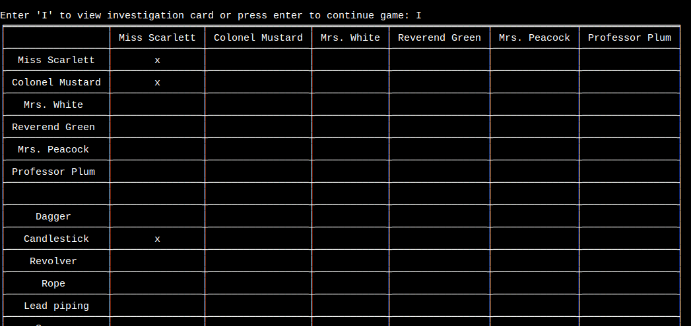  |
| Input validation - open investigation card with "investigation"  | "investigation"  |  input not accepted  | yes  |   |
| Input validation - open investigation card with number  | "0"  |  input not accepted  | yes  |   |
| Update investigation card when card shown  | completes an investigation round  | card shown and "x" placed in correct place in investigation card  |  yes |   |
| Correct cards added at start of game  | select character  |  The three cards printed at the start should correcpond to the three cards marked on the investigation card | yes  |   |

### Moving Between Rooms

|What is being tested?   |  What is the input? |  Expected response | Works as expected?  | Screenshot  |
|---|---|---|---|---|
| Move to a new room when die roll is high enough  | "5" (a room 6 spaces away)  | end up in the dining room  | yes  |   |
| Move towards a new room when die roll is not high enough  | select a room further away than the available moves and chose to move towards that room  | should print "you have moved x spaces towards y room" and finish turn in the hallway  | yes  |   |
| Stay in room  | "5" (number for currect room)  | stay in dining room  | yes  |    |
| Stay in room (after selecting far away room)  | select a room further than moves available, then when asked whether to move or to stay, choose stay  | stay in the current room  | a bug was discovered here and can be found under the bug section (Printing "You chose to stay in the hallway" instead of stay in current room - issue #12). This is now fixed.  |   |
| Use a secret passageway  | select a room that is connected by secret passageway  | move to connected room  | yes  |    |
| Cross through another room  | select a room that is further away than available moves but that has other rooms on the way  | unfortunately, the way the game board was designed, if the number of available spaces would land you in another room, it does  |  this is a known, unresolved bug and details can be found in the bugs section under "Sometimes end in wrong room bug" - issue #9 |  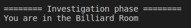 |
| You are now in the hallway  |  choose a room too far away to reach this turn, starting from a room | print "You are now in the hallway"  | yes  |   |
| You are still in the hallway  | choose a room too far away to reach this turn, starting from the hallway  | print "You are still in the hallway"  | yes  |   |

### Investigation Phase

|What is being tested?   |  What is the input? |  Expected response | Works as expected?  | Screenshot  |
|---|---|---|---|---|
| Correct suspect chosen  | each number 1-6 was tested  | corresponding suspect chosen for investigation  | yes  |  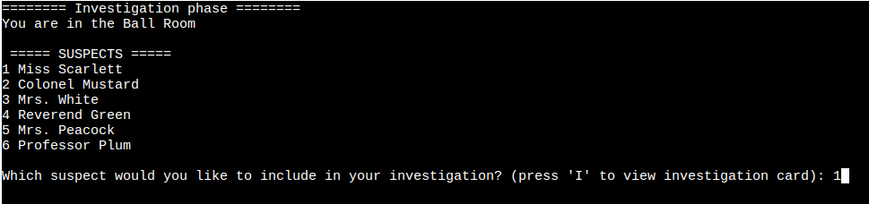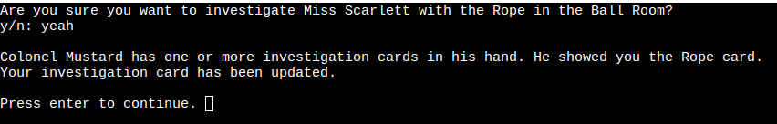 |
| Correct weapon chosen  | each number 1-6 was tested  | corresponding weapon chosen for investigation | yes  | 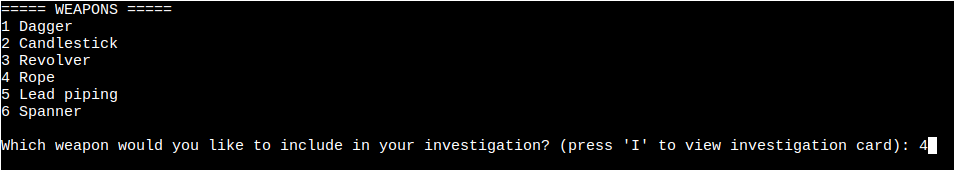  |
| Correct room chosen  | check that room choice corresponds to current room  | corresponding room chosen for investigation  | yes  | 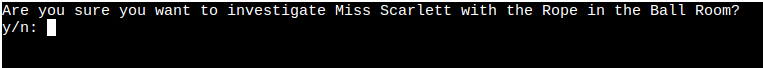  |
| Input validation - number not in range (suspect)  | "7"  | input not valid  | yes  | 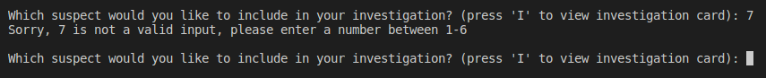  |
| Input validation - number not in range (weapon)  | "0"  | input not valid   |  yes |  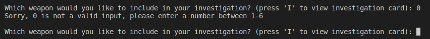 |
| Input validation - invalid string (suspect)   | "Dr Black"  | input not valid  | yes  | 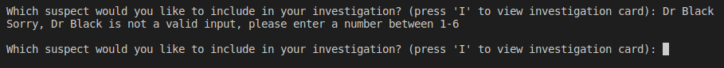  |
| Input validation - invalid string (weapon)   | "katana"  | input not valid  | yes  | 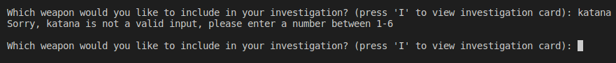  |
| Player shows an appropriate card  | n/a  | one of the three cards should be shown by a player. Cards may be shown more than once  | yes  |   |
| Card added to investigation card in correct place  | n/a  | card should gain an "x" in the correct place  | yes  | 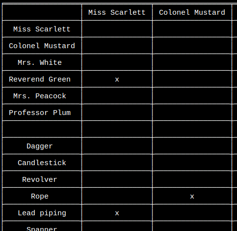  |
| y/n input validation  | "y"  | proceeds with investigation  |  yes | 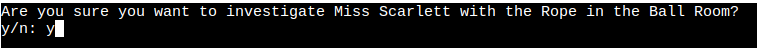  |
| y/n input validation  | "n"  | prompts for new choices  |  yes | 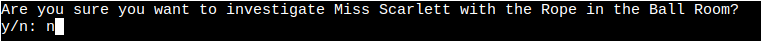  |
| y/n input validation  | "yeah"  | proceeds with investigation  |  yes |   |
| y/n input validation  | "1"  | input not valid  |  yes | 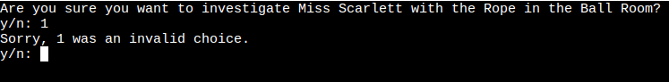  |

### Accusation Phase

|What is being tested?   |  What is the input? |  Expected response | Works as expected?  | Screenshot  |
|---|---|---|---|---|
| Correct suspect chosen  | each number 1-6 was tested (5 and 6 shown here) | corresponding suspect chosen for accusation  | yes  |  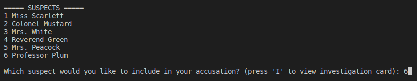 |
| Correct weapon chosen  | each number 1-6 was tested (3 and 2 shown here) | corresponding weapon chosen for accusation | yes  | 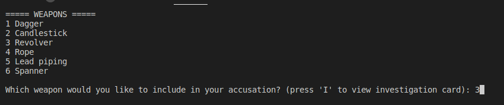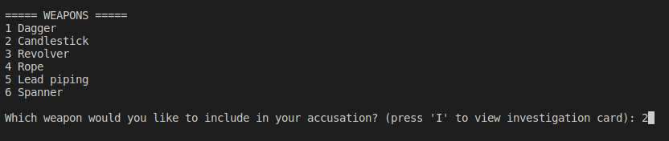   |
| Correct room chosen  | each number 1-9 was tested (6 and 7 shown here) | corresponding room chosen for accusation | yes  | 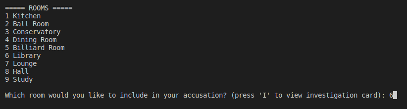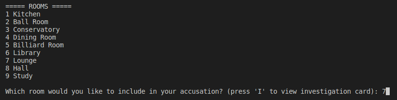   |
| correct output  | the suspect, weapon and room choices detailed above  |  should match the choices made (Peacock, Revolver, Library and Plum, Candlestick, Lounge) |  yes | 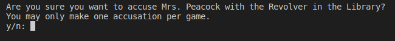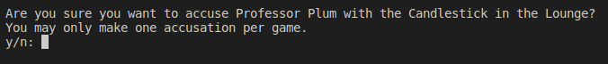  |
| Input validation - number not in range (suspect)  | "7"  | input not valid  | yes  | 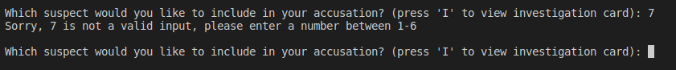  |
| Input validation - number not in range (weapon)  | "0"  | input not valid   |  yes |  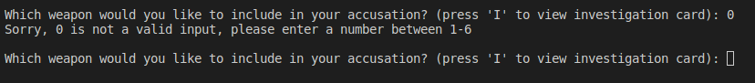 |
| Input validation - number not in range (room)  | "100"  | input not valid   |  yes |  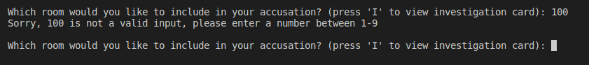 |
| Input validation - invalid string (suspect)   | "The Queen"  | input not valid  | yes  | 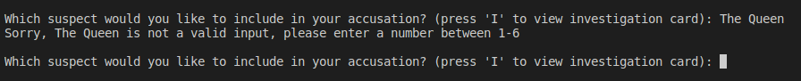  |
| Input validation - invalid string (weapon)   | "swordfish"  | input not valid  | yes  | 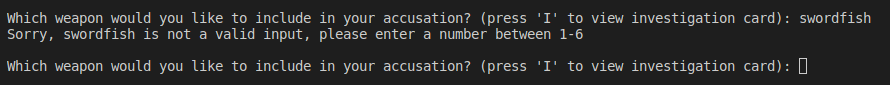  |
| Input validation - invalid string (room)   | "deathstar"  | input not valid  | yes  | 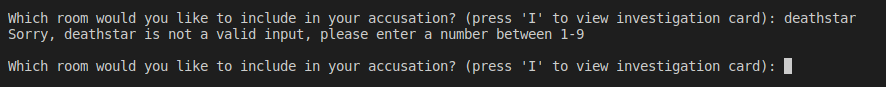  |
| y/n input validation  | "y"  | proceeds to make accusation  | yes  | 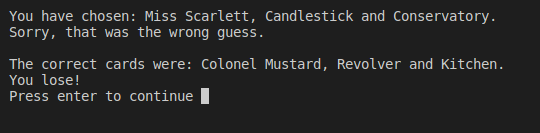  |
| y/n input validation  | "n"  | skips accusation for the round  | yes  | 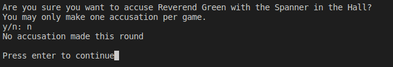  |
| y/n input validation  | "hello"  | input not valid  |  yes |   |

